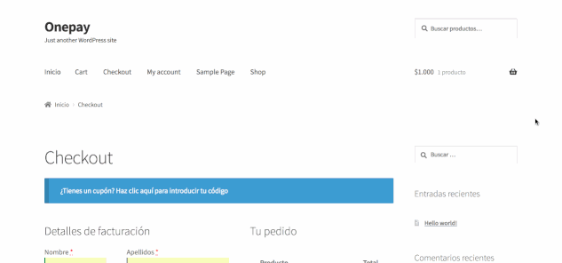

# Transbank WooCommerce Onepay Plugin

Plugin oficial de Woocommerce para Onepay

## Descripción

Este plugin de WooCommerce implementa el [SDK PHP de Onepay](https://github.com/TransbankDevelopers/transbank-sdk-php) en modalidad Checkout. 

## Demostración



## Instalación
El manual de instalación para el usuario final se encuentra disponible [acá](docs/INSTALLATION.md), y además puedes descargarlo como PDF desde [acá](https://github.com/TransbankDevelopers/transbank-plugin-woocommerce-onepay/raw/master/docs/INSTALLATION.pdf
)

## Requisitos 
* PHP 5.6 o superior
* Wordpress
* WooCommerce 3.2 o superior

## Dependencias

El plugin depende de las siguientes librerías:

* transbank/transbank-sdk
* setasign/fpdf
* apache/log4php

Para cumplir estas dependencias, debes instalar [Composer](https://getcomposer.org), e instalarlas con el comando `composer install`.

## Desarrollo

Para apoyar el levantamiento rápido de un ambiente de desarrollo, hemos creado la especificación de contenedores a través de Docker Compose.

Para usarlo, debes tener Docker y Docker Compose instalado en tu máquina, para luego ejecutar:

```bash
docker-compose up
```

De forma automática se creará una imagen Wordpress, se instalará WooCommerce con el tema Storefront, se creará un producto de ejemplo y finalmente se activará este plugin. Para acceder debes dirigir tu navegador hacia `http://localhost:8080`.


Los datos de acceso a la administración son los siguientes:

* Url: http://localhost:8080/wp-admin
* Usuario: onepay
* Contraseña: onepay

## Generar una nueva versión

Para generar una nueva versión, se debe crear un PR (con un título "Prepare release X.Y.Z" con los valores que correspondan para `X`, `Y` y `Z`). Se debe seguir el estándar semver para determinar si se incrementa el valor de `X` (si hay cambios no retrocompatibles), `Y` (para mejoras retrocompatibles) o `Z` (si sólo hubo correcciones a bugs).

En ese PR deben incluirse los siguientes cambios:

1. Modificar el archivo CHANGELOG.md para incluir una nueva entrada (al comienzo) para `X.Y.Z` que explique en español los cambios.

Luego de obtener aprobación del pull request, debes mezclar a master e inmediatamente generar un release en GitHub con el tag `vX.Y.Z`. En la descripción del release debes poner lo mismo que agregaste al changelog.

Con eso Travis CI generará automáticamente una nueva versión del plugin y actualizará el Release de Github con el zip del plugin.
